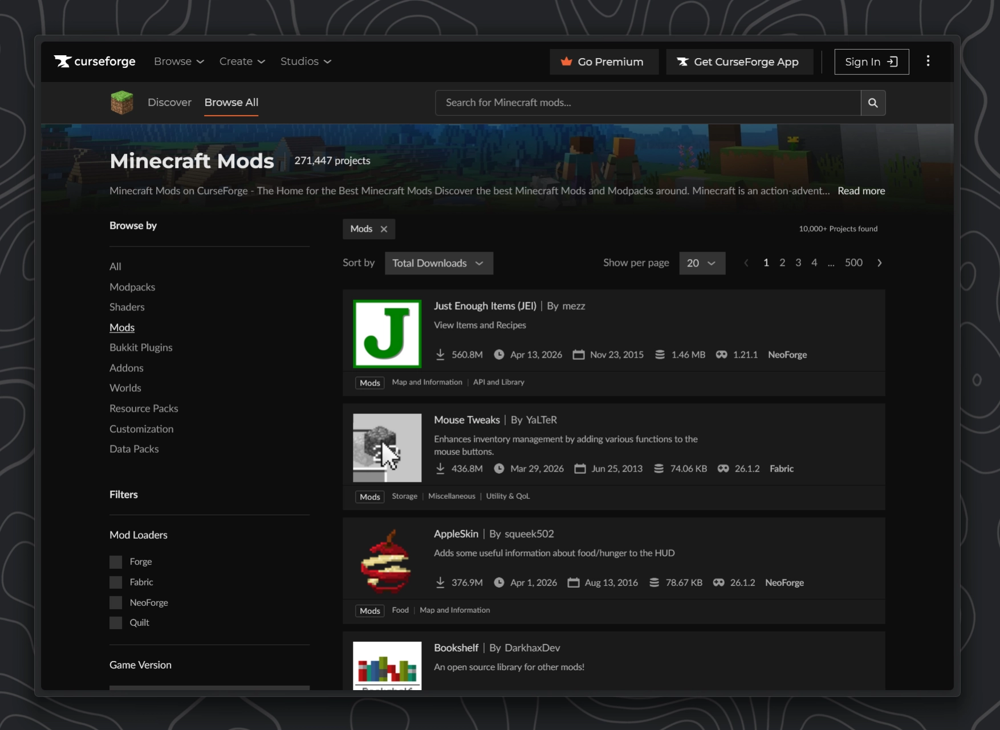
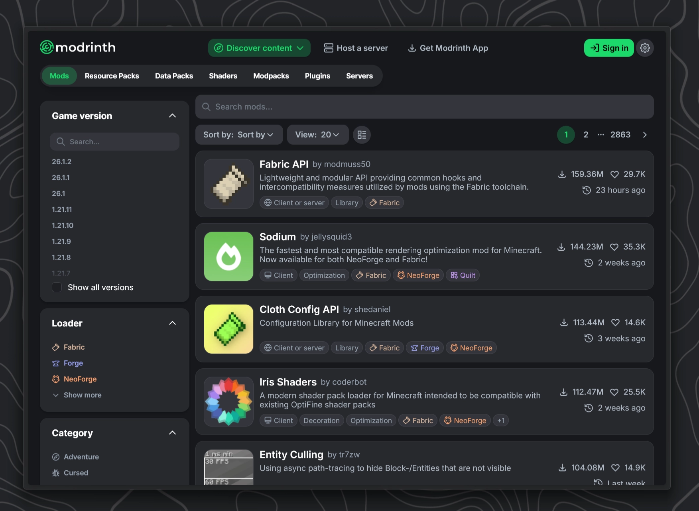
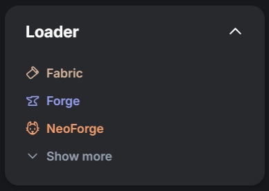
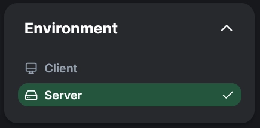
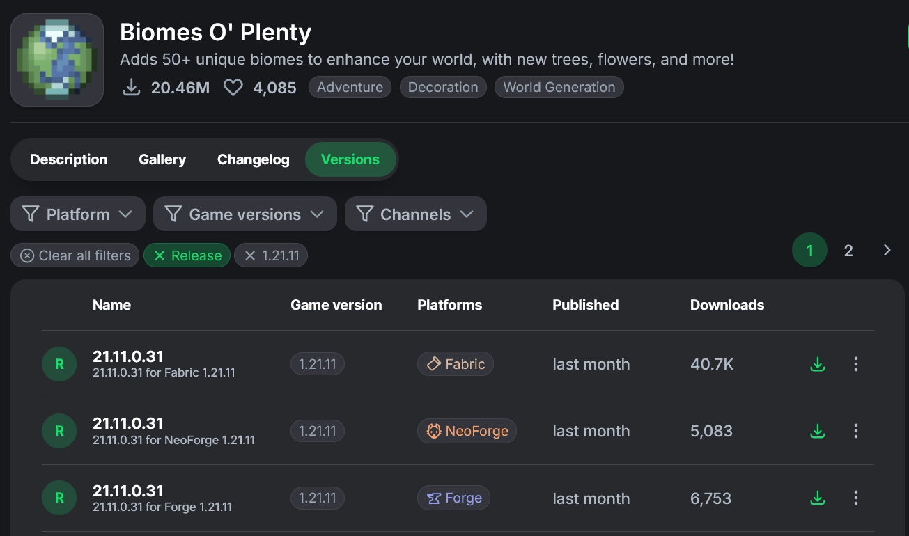
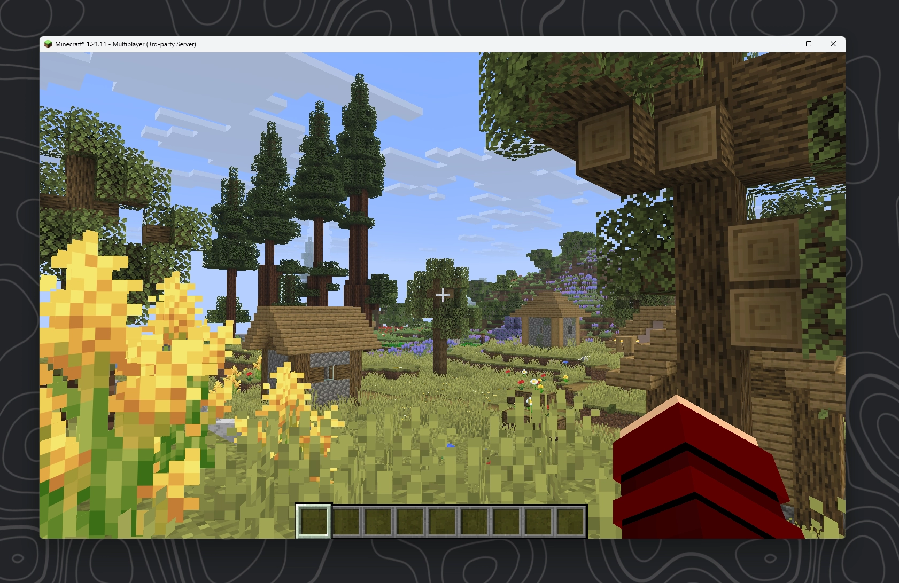

### Installing mods

Installing mods on any of the 3 modloaders works pretty much in the exact same way. Once you have accepted the EULA and booted up the server again there should be a `mods` folder in your server folder now:

```tree
options:
  showToolbar: false
tree:
- name: "Modded Server"
  children:
      - name: mods
        open: false
        type: folder
      - start.bat
      - ....

```

As you might have already guessed, similar to how we [installed plugin](#installing-plugins) for our plugin servers, we can now download any mod and just put the mod `.jar` file into this folder. Please be aware though that most mods will also need to be installed on the client for your players to connect.

#### Where to download mods

In {{year}} there are really just 2 popular websites to download mods, one of which we already talked about:

<div style="display:flex; flex-direction:row; gap:16px; align-items:flex-start;">

<div style="width:50%;">

[CurseForge](https://www.curseforge.com/minecraft/search?class=mc-mods&page=1&pageSize=20&sortBy=total+downloads)



Similar to SpigotMC, CurseForge is one of the old players. Its been around for ages and still hosts many mods that have been abandoned for many years now.

</div>
<div style="width:50%;">

[Modrinth](https://modrinth.com/discover/plugins?g=categories:paper&s=downloads) `Recommended`<br>



Starting in 2020 Modrinth quite literally changed the game. They are an open-source modding and plugin platform. They also offer their own launcher, Modrinth App. The offer a cleaner UI and UX over Curseforge but lacky many older mods that were already abandoned by the developer before Modrinth even launched.

</div>
</div>

While I would generally recommend ==Modrinth over Curseforge==, mainly just because I like the UI better and you don't have to wait 5 seconds before downloading anything, both of these websites are pretty good.<br>
If you are more into older modpacks like for version 1.7.10 and 1.12.2, there is pretty much now way getting around CurseForge.

While most developers that publish their mods now usually do so on both sites, there are still noticeable exceptions. Like for example the very popular RlCraft Modpack only being available on CurseForge. In the end you should probably just search Google for the mod you like and then download from the suggested page.

When searching for Mods make sure to configure the filters for your mod loader and your server's Minecraft version. Optionally you can filter specifically for mods that are meant to run on a server.

<div style="display:flex ; width:98%; flex-direction:row; gap:16px; align-items:flex-start;">

  

  

  

</div>

#### Example: Downloading Biomes O' Plenty from Modrinth

Alright for this example lets download the very popular [`Biomes O' Plenty`](https://modrinth.com/mod/biomes-o-plenty) Mod which has over **212** million downloads on CurseForge and another **20** million on Modrinth. It is one of most popular biome mods out there.

<a href="https://modrinth.com/mod/biomes-o-plenty" target="_blank" rel="noopener">
  
</a>

While there a many even more popular mods out there, many of them are only working on the client. Biomes O' plenty is a good example for a mod that mainly lives on the server because this is where all the world generation is handled.

<div style="display:flex; width:98%; flex-direction:row; gap:16px; align-items:flex-start;">

  <div style="width:50%;">

Let's head to the `Versions` tab and set a filter that matches our server. In this example I want to run this mod on a Fabric 1.21.11 server. I also set the filter to `release` so we don't get any buggy alpha or beta versions. Continue by clicking the small green download button next to the version you want.

 </div>

  

</div>

##### Check for dependencies

Many mods need other mods installed as well to work properly, these are called **dependencies**.
Let's check if Biomes O' Plenty needs any other mods:

From the official description:

> Requires [**GlitchCore**](https://modrinth.com/mod/glitchcore) for Minecraft 1.20.4 and above!<br>
> Also requires [**Fabric API**](https://modrinth.com/mod/fabric-api) for Fabric version.<br>
> Requires [**TerraBlender**](https://modrinth.com/mod/terrablender) for Minecraft 1.18 and above!

We continue by also downloading these 3 mods for our specific version.

---

As previously explained, we now need to drag the downloaded mod files into our server's `mods` folder.
If you followed everything above correctly, your folder should now look somewhat like this:

```tree
options:
  showToolbar: false
tree:
- name: "Fabric Server"
  children:
      - name: libraries
        open: false
        locked: true
        type: folder
      - name: mods
        open: true
        type: folder
        children:
          - BiomesOPlenty-fabric-1.21.11-21.11.0.31.jar
          - GlitchCore-fabric-1.21.11-21.11.0.4.jar
          - fabric-api-0.141.3+1.21.11.jar
          - TerraBlender-fabric-1.21.11-21.11.0.0.jar
      - name: ...
        open: false
        locked: true
        type: folder
      - server.jar
      - run.bat
      - ...

```

:::warning
Since the Biomes O' Plenty mod will modify our world generation, we should delete the world of our server if it had any prior to this. <br>
Delete the `world` folder before proceeding.
:::

---

##### Joining the Server {#joining-modded-example}

As I mentioned above we will need to install all of these mods also on our client.
Therefore lets start up a client with the same fabric version as our server and the 4 mods above.

After joining as described in [#Starting the Server](#joining-modded) we should see that we can now see the new biomes from the `Biomes O' Plenty` mod.


