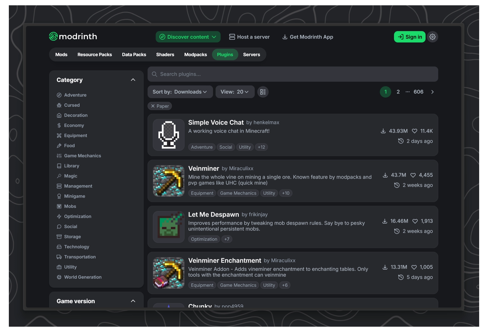
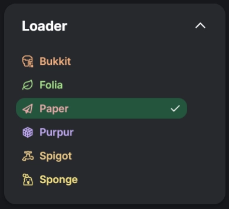
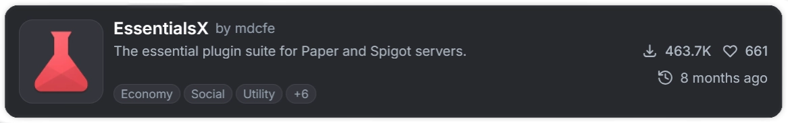

### Installing plugins

After we first started the server, a `plugins` folder was automatically created in our server folder.
This is now the part where working with a Paper server really becomes fun. You can download any plugin from the internet that is compatible with your version and drop it directly into this `plugins` folder.

After adding a new plugin make sure to ==restart the server==. Alternatively use the command `/reload` but please be aware that a clean restart is always safer and better.

#### Where to download plugins

Before we continue you need to understand that their are other plugin platforms besides PaperMC. These platforms like Spigot and CraftBucket had been the norm for many years since the earliest years of the game. But since around 2018 / 2019 many server owners switched form Spigot to PaperMC because of performance benefits.

If you want to install mods you need to make sure that they are compatible with our platform, in this case `PaperMC`.

But here is the twist: `PaperMC` was originally developed as a fork of Spigot, meaning they essentially started as a copy of Spigot until the PaperMC developers started adding their own features that where not present in Spigot.<br>
Until Minecraft `1.21.4` the Paper team tried to keep Spigot Plugins compatible with Paper as well, but since then they dropped that support.
This means that at this point, as long as your server runs on `1.21.4` or older, there are still many Spigot plugins out there that even though they officially don't support Paper run just fine.

In general there are 2 main website most people use if they want to browse for plugins

<div style="display:flex; flex-direction:row; gap:16px; align-items:flex-start;">

<div style="width:50%;">

[SpigotMC](https://www.spigotmc.org/resources/categories/spigot.4/?order=download_count)


SpigotMC has been around for an eternity (2012!) and has for many years been pretty much the place to be if you want to publish your own plugin.
Unfortunately there is no filter for plugins that are compatible with PaperMC so you will have to filter for Spigot and prey that it just works.

</div>
<div style="width:50%;">

[Modrinth](https://modrinth.com/discover/plugins?g=categories:paper&s=downloads) `Recommended`<br>



Starting in 2020 Modrinth quite literally changed the game. They are an open-source modding and plugin platform. They also offer their own launcher, Modrinth App. The offer a far better experience than SpigotMC by having: A better UI, more filters and a larger library of mods and plugins!

</div>
</div>

---

#### Example: Downloading EssentialsX from Modrinth

When searching for Plugins make sure to set filters for Paper and your server's Minecraft version.

<div style="display:flex ; width:50%; flex-direction:row; gap:16px; align-items:flex-start;">

  

  

</div>

For this example I choose the plugin [`EssentialsX`](https://modrinth.com/plugin/essentialsx) which is a pretty well know for adding a bunch of very useful commands like: `/sethome, /home, /tpa, /fly, /rules` etc.<br> You can find a full list [here](https://essentialsx.net/commands)

<a href="https://modrinth.com/plugin/essentialsx" target="_blank" rel="noopener">
  
</a>

Click on the `Versions` tab. Here you can once again filter all the different released versions of this plugin. Make sure to find a version that supports Paper in the `Platforms` row and includes your minecraft version under `Game versions`


If you found the perfect version, click the green download button on the right.

As you might have guess this downloaded file now needs to go into our `plugins` folder. In the end your server should look like this:

```tree
options:
  showToolbar: false
tree:
- name: "Paper Server"
  children:
      - name: cache
        open: false
        locked: true
        type: folder
      - name: libraries
        open: false
        locked: true
        type: folder
      - name: logs
        open: false
        locked: true
        type: folder
      - name: plugins
        open: true
        type: folder
        children:
          - EssentialsX.jar
          - ...
      - name: versions
        open: false
        locked: true
        type: folder
      - eula.txt
      - server.jar
      - server.properties
      - start.bat

```

Don't worry if your plugin name is different, the only thing that matters is that we move the `.jar` file into our `plugins` folder.

Now restart the server.

---

Some plugins send a log to the console once they get loaded during server start up.
The EssentialsX Plugin for example prints this line during startup:

```log
[22:44:49 INFO]: [Essentials] Enabling Essentials v2.21.2
```

<div style="display:flex; flex-direction:row; gap:16px; align-items:flex-start;">

  <div style="width:40%;">

Once you join the server you should see a welcome message from Essentials and should be able to perform commands like `/help`

You can install every other plugin in the exact same way.

 </div>

  

</div>
