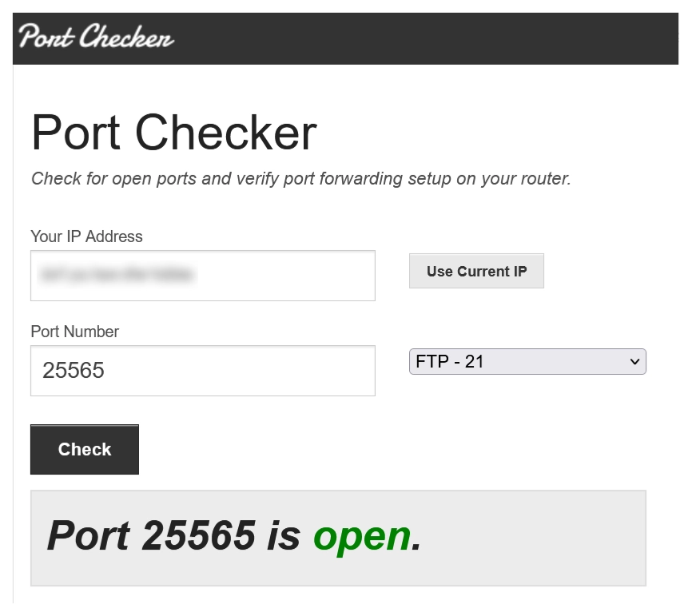

# Portforwarding

## What is portforwarding?

Portforwarding means that you open a port on your router so that people from outside can connect to your computer.

In simple terms you can imagine your router and its ports like a big house with many doors.
Every program, application on your computer, phone etc. communicate with the internet over a specific port. You can imagine that every port has a corresponding door in this house where you will find a room behind it with every app / programm in it that use that port for communicating.

You reading this text on my website or watching my videos means that your router has opened the port 443 for `outgoing connections`, because that is the port webbrowsers like chrome or safari use to access websites. At the same time that means that the router this website is running under needs to have the port 445 open for `incoming connections`.

## Why do we need that for a Minecraft Server?!

Minecraft Servers use the special port `25565` which is not open by default. While it is usually open for outgoing connections, meaning that you can join servers as a player, it is usually disabled for incoming connections, meaning that none of your friends can connect to a server on your computer at the moment.

While you can technically change the port your server is running on, I would recommend against that. By default every server runs on `25565`.<br>
In Minecraft you add the port to an ip like this: `<ip>:<port>`, if you don't provide a port Minecraft will assume you want to connect via the standard port.

This is also the reason why you can join for example Hypixel either with `hypixel.net` or `hypixel.net:25565`

## Risks

In general opening a port for incoming connections only carries a risk if you open a port that is used by many programs. If only one of these programs is having an unknown vulnerability then you could become the target for an attack.

But fear not! Luckily the `25565` port is only used by Minecraft Servers and is generally pretty unused.
Also: Connections to your PC only work when there is actually an open application communicating over that port. That means as soon as you close your Minecraft server every incoming connecting will be blocked.

## How to open the port?

Well now its getting interesting and difficult at the same time.<br>
In order for you to open a port on your router you will have to go into your router settings and manually configure it.

### But how do I access my router settings?

Unfortunately there no _one_ way to do that because it really depends on which kind of router you have.
One thing that usually is the same for every router is that they host a small website (`Admin Panel`) for configuration that is only accessible if you are currently connected to its WIFI.

The URL / Link on which you can configure your model differs from router to router. But here is a list of the most common ones:

[192.168.1.1](http://192.168.1.1) - [192.168.0.1](http://192.168.0.1) - [192.168.178.1](http://192.168.178.1) - [10.0.0.1](http://10.0.0.1) - [192.168.1.254](http://192.168.1.254)

I would recommend trying every one of these. If you are lucky one of these will work while every other one will just not load.
Don't worry if these links look a bit fish, all of these IP addresses are only local-network meaning that they only connect you to other devices that are connected to your WIFI router.

If none of the links above work you can try searching for you router model (like AT&T, TP-Link etc. ) online. You search for `Router Name + Admin Panel` or directly for a portforwarding guide for that router.

### Finding the Admin Password

Usually the configuration page / Admin panel of routers are secured by a password. It will either be printed somewhere below or behind the device on a sticker or something similar. Alternatively if you had your internet provider install the router for you, they might have told someone the password. If you did not change the default password, you can also search online for the default password and username for your specific router.
You can also try just typing `admin` for either password or username (if there is an input for that) or even for both.

### Finding your PC's IP address

Before continuing we need to find out the local IP address for the computer the server will be running on.
In Windows open the terminal and enter the command `ipconfig` and press enter.
Look for your WIFIs / LANs internet adapter and then for:

```log
IPv4-Address  . . . . . . . . . . : <IP>
```

Note down that IP somewhere, we will need it later.

### Opening the port

Once you logged in successfully, search for a menu called portforwarding, commonly you should find it somewhere in your home network settings.

Create a rule for your computer. Usually there should be a button to add a device somewhere and then a dropdown where you can either select your computer by name or by matching the local IPv4 address we looked up in the previous step. Really make sure that this matches because if not, people trying to connect might reach your Smart Fridge instead lol.

Be sure to add a rule for the following ports and protocols:

`TCP` -> `25565`<br>
`UDP` -> `25565`

If you want to know what TCP and UDP are and how you can get a fancy ip made from letters like `hypixel.net` instead of your current number ip, check out the [IPs and Domains Guide](./ips-and-domains)!

### 🎉 That's it!

Once you saved the rules above, your PC should be ready for accepting incoming connections on the Minecraft Port.
You can find out if it worked correctly by starting a Minecraft server and then visting a port checker website like
[portchecker.co](https://portchecker.co/)

<div style="display:flex; flex-direction:row; gap:16px; align-items:flex-start;">

  <div style="width:40%;">

If you did everything correctly it should say that your port is open!

If this guide was helpful to you, please share it with your friends!

If you want to further support me:
[YouTube](https://youtube.com/@celtrii) [Patreon](https://patreon.com/Celtrius)

 </div>

  

</div>
