<script setup lang="ts">
import YouTubeCard from "@comp/YoutubeCard.vue"
import MinecraftBatGenerator from "@comp/MinecraftBatGenerator.vue"
import LazyYoutube from '@comp/LazyYoutube.vue'
const year = new Date().getFullYear()
</script>

# How to Create a Minecraft Server in 2026 {# }

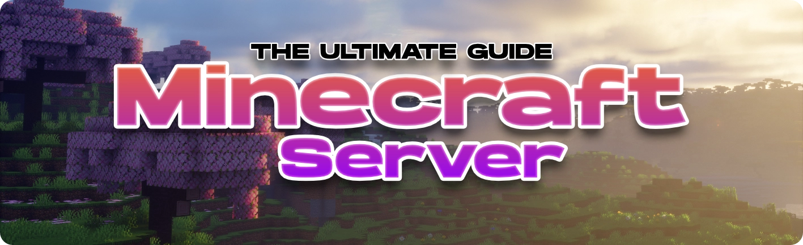

<!-- <YouTubeCard
  title="How to create a Minecraft Server (2026)"
  href="https://www.youtube.com/watch?v=-h_D9IEJOeM"
  thumbnail="https://img.youtube.com/vi/-h_D9IEJOeM/maxresdefault.jpg"
  description="A walkthrough of the feature shown in this guide."
/> -->

So you decided to create your own Minecraft server?<br>
Then this is the perfect guide for you! 🌟

Whether you want to play Vanilla with friends, create a minigames network like Hypixel or run a full modpack, this tutorial will walk you through everything step by step from start to finish. In the end you should know how to locally host your own server completely for free!

## 🧭 Choose Your Path {#path}

The first decision you should make is choosing which kind of server you want to create.
==**Click on the images and follow the guide from there.**==

<div style="display:flex; gap:16px; width:98%;">

  <div style="width:33%;">
    <a href="#vanilla" style="width:33%;">
      
    </a>

[==🌟 Vanilla Server==](#vanilla) <br>
Simple server for playing with friends

  </div>

  <div style="width:33%;">
    <a href="#plugins" style="width:33%;">
      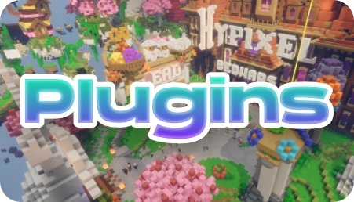
    </a>

[==🌍 Plugin Server==](#plugins) <br>
Add commands and custom features

  </div>

  <div style="width:33%;">
    <a href="#modded" style="width:33%;">
      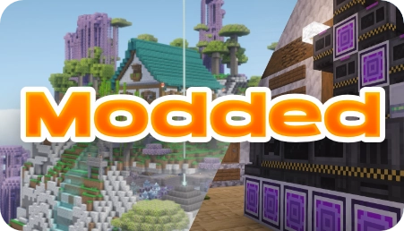
    </a>

[==🚀 Modded Server==](#modded) <br>
Install mods and modpacks

  </div>

</div>

## 📖 Getting Started {#getting-started}

The sections below apply to all server types.<br>
You can either start now by following the [folder](#folder) and [Java](#java) guides below or instead start by following your server type specific instructions which tell you exactly when which step makes sense to complete.

### Terminology

If you are new to game servers in general, I know that many people struggle with understanding all the new terms when they are just getting started. Therefore I created a terminology [glossary](./glossary) which should be able to help you. You can you also try searching for the word you don't understand in the navigation bar at the top.

---

### Server Folder Setup {#folder}

Having good organization early on is pretty important when you start creating multiple servers for different purposes:

- Start by creating a folder called `Minecraft Servers` or something similar, somewhere where you will remember its location. I would recommend either putting it at the ==root== (most top level folder) of an external hard-drive, in your documents folder or somewhere in your user folder.
- Inside that folder we will put all folders for our different Minecraft servers. Start by creating a new folder inside that one and calling it `First Server` or something similar. The important part is that you remember which server is inside that folder without having to boot it up.
- If

Going forward let's assume you put the folder inside an external harddrive (e.g. `D:/`)
You will want to name your individual servers as descriptive as possible:

<div style="display:flex; flex-wrap:wrap; gap:16px; align-items:flex-start;">

<div style="flex:1 1 320px; min-width:0;">

Good 🌟

```tree
options:
  showToolbar: false
tree:
- name: "D:"
  children:
    - name: "Minecraft Server"
      children:
        - name: 1. Minecraft Server
          open: false
          children:
            - ...
            - ...
        - name: 2. Minecraft Server
          open: false
          children:
            - ...
            - ...
        - name: 3. Minecraft Server
          open: false
          children:
            - ...
            - ...
```

</div>

<div style="flex:1 1 320px; min-width:0;">

Better 🚀

```tree
options:
  showToolbar: false
tree:
- name: "D:"
  children:
    - name: "Minecraft Server"
      children:
        - name: Vanilla 1.21 SMP
          open: false
          children:
            - ...
            - ...
        - name: RlCraft Modpack
          open: false
          children:
            - ...
            - ...
        - name: Creative Server
          open: false
          children:
            - ...
            - ...
```

</div>
</div>

---

### Choosing a Java Version {#java}

Minecraft uses different Java versions depending on the game version. Before starting your server, please make sure that you have the correct Java version installed.

| Minecraft Version |    Java | Download                                                          |
| ----------------- | ------: | ----------------------------------------------------------------- |
| 1.16.5 and older  |  Java 8 | [Adoptium](https://adoptium.net/de/temurin/releases?version=8)    |
| 1.17              | Java 16 | [Adoptium](https://adoptium.net/de/temurin/releases?version=16)\* |
| 1.18 - 1.20.4     | Java 17 | [Adoptium](https://adoptium.net/de/temurin/releases?version=17)   |
| 1.20.5            | Java 21 | [Adoptium](https://adoptium.net/de/temurin/releases?version=21)   |
| 26.1 and newer    | Java 25 | [Adoptium](https://adoptium.net/de/temurin/releases?version=25)   |

When you have decided on which Minecraft version your server will run, click the download link next to the corresponding Java version. This will redirect you to download page for Eclipse Temurin.

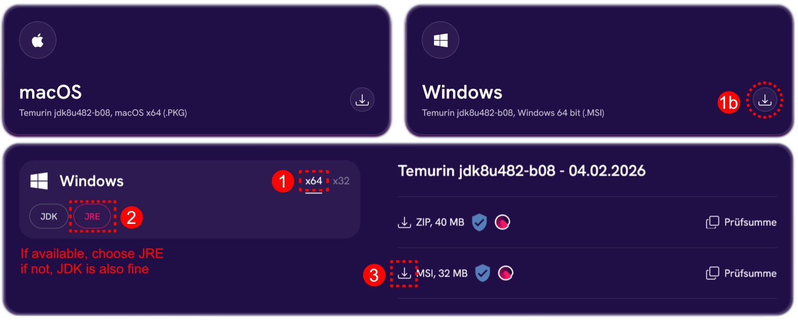

You can either click that big download button in the top right next to ==Windows== or scroll down to the Windows Section. Here you will want to select `x64` and then `JRE` if that option is available. Then click the MSI download button on the right.

<div style="display:flex; flex-wrap:wrap; gap:16px; align-items:flex-start;">

<div style="flex:1 1 320px; min-width:0;">

When going through the installer make sure to select ==install on local harddrive== when asked if you want to change the `JAVA_HOME` variable.

After the installation you can check if everything worked fine by opening a terminal and entering the command<br> `java -version`. This should report the version back to you, which you just installed.

</div>

<div style="flex:1 1 320px; min-width:0;">

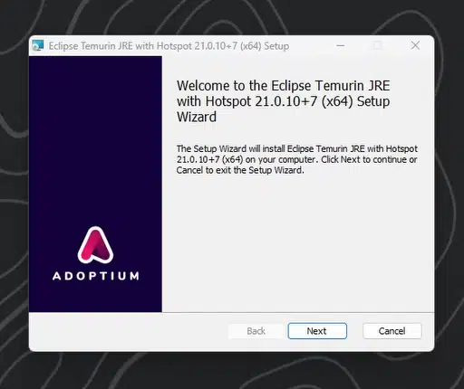

</div>
</div>

::: info
Temurin is a free, open-source distribution of the Java Development Kit (JDK) built from OpenJDK and maintained by the Eclipse Adoptium project.
:::

---

### Creating a batch file {#batch}

You should only follow the next steps once you have downloaded the server file for your server. If you haven't, you might want to choose a [path](#path) first.

If we want to ==start a Minecraft server== we need to ==create a batch file==.

You can think of the batch file as a ==shortcut or preset== that tells the server file how to run the server e.g. how much RAM it should be able to use etc. It is usually a very easy task but there are many little things that can go wrong that might throw you off.

Before starting with the steps below ==open your file explorer== and ==open the folder== you want your server to be created in, like e.g. `Survival SMP`, `1. MC Server` etc.

1. ==Enable File Extensions==<br>
   **View** > **Show** > **File Extension**

2. ==Create a new text file:==<br>
   **Right click** in explorer > **New** > **New text document**

3. ==Renaming the file==<br>
   **Right click** the file > **rename** > `start.bat`<br>
   Make sure that the file no longer has the `.txt` ending and ends with `.bat`

4. ==Confirm renaming and file type==<br>
   Click `Yes` when windows asks you if you want to change the file type.<br>
   After: **View** > **Details**<br>
   Check if under the ==Type== row it says "Windows Batch File"

5. ==Start editing the file==<br>
   **Right click** the file > `Edit in Notepad` / `Edit`

---

#### Simple Batch file {#edit-batch}

This is the most basic form of a batch file.<br>
It gets executed from top to bottom. If you want to understand more about batch files and what each line here does, check out my [detailed guide](./batch-file) for batch files.

The version below starts the server (`server.jar`) with ==4GB of RAM==.<br>
You can change the values at `-Xms` and `-Xmx` to change that.

```bat:line-numbers
@echo off
java -Xms4G -Xmx4G -jar server.jar nogui
pause
```

:::warning
The `server.jar` part in the `batch file` above is directly referencing the server file (`server.jar`) which we will later download and move into the same folder.<br> These names need to **ALWAYS** match.
:::

```tree
options:
  showToolbar: false
tree:
- name: "Server Folder"
  children:
      - name: start.bat
        description: "Batch file"
        preview: "....\n -jar server.jar nogui\n...."
      - name: server.jar
        description: "server file"
        note: "The name of this file needs to match with the line in the batch file"

```

Just to make this 100% clear, below you can find an example using the simple batch file template where I renamed the server to another name like for example `paper-server.jar`

<div style="display:flex; flex-wrap:wrap; gap:16px; align-items:flex-start;">

<div style="flex:1 1 320px; min-width:0;">

📁 Server folder:

```tree
options:
  showToolbar: false
tree:
- name: "Server Folder"
  children:
      - name: start.bat
        preview: "....\n -jar paper-server.jar nogui\n...."
      - name: paper-server.jar

```

</div>

<div style="flex:1 1 320px; min-width:0;">

💾 `start.bat`

```bat
@echo off
java -Xms4G -Xmx4G -jar paper-server.jar nogui
pause
```

</div>
</div>

---

Below you can find an optional advanced batch file with further optimizations. Click on `Details` to find out more.

::: details

#### Optimized Batch File {#opti-batch}

There are custom flags you can add to a batch file which tell the server more specifically how to handle memory.
The specific tweaks below are based on extensive research by Aikar, one of the developers behind PaperMC, who tried to find the most ideal flags to optimize server performance.
[Aikar's Flag Guide](https://aikar.co/2018/07/02/tuning-the-jvm-g1gc-garbage-collector-flags-for-minecraft/) [Github](https://github.com/aikar) <br>

The version below starts the server (`server.jar`) with ==4GB of RAM==.<br>
You can change the values at `-Xms` and `-Xmx` to change that.

```bat:line-numbers{3,12}
@echo off
title Minecraft Server
java -Xms4G -Xmx4G ^
-XX:+UseG1GC -XX:+ParallelRefProcEnabled -XX:MaxGCPauseMillis=200 ^
-XX:+UnlockExperimentalVMOptions -XX:+DisableExplicitGC ^
-XX:+AlwaysPreTouch -XX:G1NewSizePercent=30 -XX:G1MaxNewSizePercent=40 ^
-XX:G1HeapRegionSize=8M -XX:G1ReservePercent=20 -XX:G1HeapWastePercent=5 ^
-XX:G1MixedGCCountTarget=4 -XX:InitiatingHeapOccupancyPercent=15 ^
-XX:G1MixedGCLiveThresholdPercent=90 -XX:G1RSetUpdatingPauseTimePercent=5 ^
-XX:SurvivorRatio=32 -XX:+PerfDisableSharedMem -XX:MaxTenuringThreshold=1 ^
-Dusing.aikars.flags=https://mcflags.emc.gs -Daikars.new.flags=true ^
-jar server.jar nogui
pause
```

> [!IMPORTANT]
> In line 12 above you can see `-jar server.jar nogui`.
> The `server.jar` part is directly referencing the server file name in the same folder as the batch file.<br>
> ==**MEANING**: The name of the== `server file` ==and the== `server.jar` ==part must **ALWAYS** match==

:::

## 🌟 Vanilla Server {#vanilla}


---

This section is meant to explain how to create a basic Minecraft vanilla server. This means we will run an unmodified game server which does not support plugins or mods. This will give you the most pure Multiplayer experience, perfect for your first project, a creative server or speedrunning.

<!-- If you want to create an SMP server for your friends I would recommend taking a look at the [Plugin Section](#plugins) instead. -->

Before continuing make sure to create a new folder for your server as explained in the [folder creation](#folder) guide. You should also download and install the [correct Java version](#java) for your Minecraft version.

---

### Download Server file{#vanilla-server}

In order to download the server file for a vanilla server you need to open your ==Minecraft Launcher==. Make sure you have `Java Edition` selected and then click on the `Installations` tab. The next step is to click the `New Installation` button.

<div style="display:flex; flex-direction:row; gap:16px; align-items:flex-start;">

  

  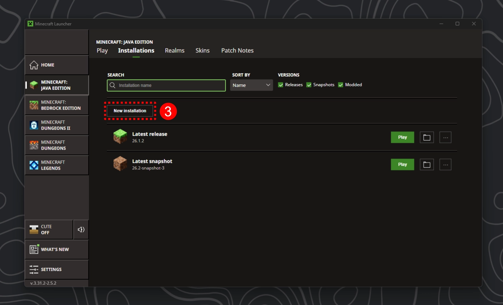

</div>
<br/>

<div style="display:flex; flex-direction:row; gap:16px; align-items:flex-start;">
  <div style="width:70%;">

Once you click the `New Installation` button, select the Minecraft version you want your server running on.<br><br>
After that click the little `Server🔗` text. This will download the official vanilla server for that version from official Mojang servers.

 </div>
  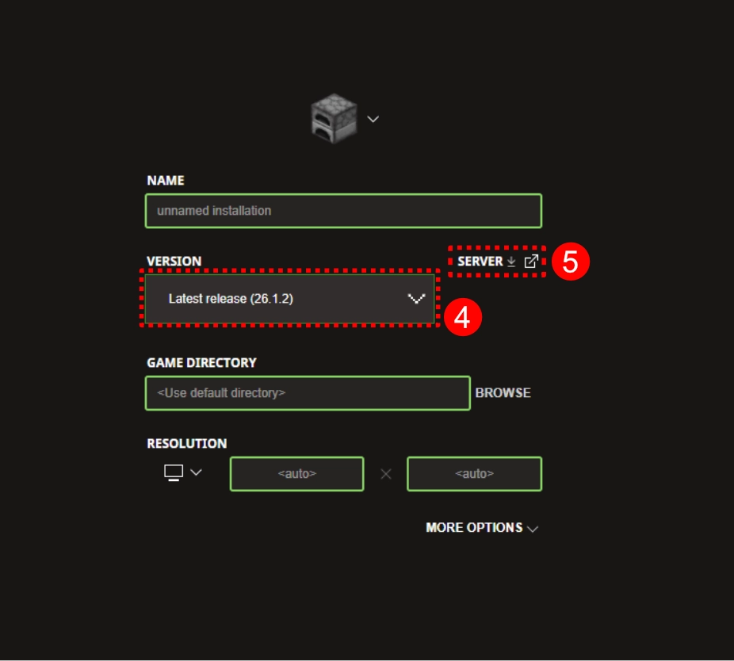

</div>

::: info
If not done already, check which Java version you need for that Minecraft version with the [table](#java) above.
Make sure that when you open a terminal and enter the command `java -version` that it reports this back to you for confirmation.
:::

---

### Folder Setup {#vanilla-folder}

Move the `server.jar` file we just downloaded to your server's folder that you previously created with the [folder creation](#folder) guide. <br>
It's now time to create a `batch` file for your server. We will need this file to start our server file with custom settings.
Read the [instructions](#batch) carefully and come back when you created a `start.bat` file.

---

If you followed the [folder creation](#folder), [batch file creation](#batch) and the upper [server.jar](#vanilla-server) instructions correctly, your folder should now look like this:

```tree
options:
  showToolbar: false
tree:
- name: "Vanilla Server"
  note: "Or however you want to call your server"
  children:
      - start.bat
      - server.jar

```

---

### First Launch and EULA {#vanilla-launch}

Alright, now its getting interesting! Don't give up, you're nearly there! 🎉

1. Double click the `start.bat` file and watch your server boot up for the first time and immediately crash :(
2. But luckily this is completely normal and the server even gives you the reason why! If we take a look at the logs inside the terminal a few lines from the bottom you will find:<br>
   `[16:57:58] [ServerMain/INFO]: You need to agree to the EULA in order to run the server. Go to eula.txt for more info.`

If we take a look at our server folder now, you should notice that a few new files were created.
It should look more or less similar to this:

```tree
options:
  showToolbar: false
tree:
- name: "Vanilla Server"
  children:
      - name: libraries
        open: false
        locked: true
        type: folder
      - name: logs
        open: false
        locked: true
        type: folder
      - name: versions
        open: false
        locked: true
        type: folder
      - eula.txt
      - server.jar
      - server.properties
      - start.bat

```

As you might already suspect, in order to agree to Mojang's EULA you need to open the `eula.txt` file with a text editor. <br>
At the bottom of the file you will find the text `eula=false` which you will have to change to `eula=true` and then save the file.
Please be aware that by setting this value you agree to the [offical Minecraft EULA](https://www.minecraft.net/eula).
The EULA is a set of rules for server owners that for example ban pay to win by making it illegal to sell items on a server that give you a clear gameplay advantage over other players.

---

### Starting & Joining {#vanilla-start}

Alright, this is it! After opening the batch file again we can see that this time the server does not crash.
If you take a look at the console or the server folder, you can see that there is now a world being generated in the folder! <br>
Good job! Your server is now up and running. 🎉

```log{6}
[17:18:11] [Server thread/INFO]: Preparing level "world"
[17:18:11] [Server thread/INFO]: Selecting global world spawn...
[17:18:12] [Server thread/INFO]: Loading 0 persistent chunks...
[17:18:12] [Server thread/INFO]: Preparing spawn area: 100%
[17:18:12] [Server thread/INFO]: Time elapsed: 1200 ms
[17:18:12] [Server thread/INFO]: Done (1.321s)! For help, type "help"
```

---

#### Joining the server {#vanilla-join}

1. Launch a client with the same Minecraft version as your server.
2. Go to Multiplayer and add a new server with the IP: `localhost`
3. You should be able to instantly join. The console should show something like this:

```log
[17:40:10] [User Authenticator #1/INFO]: UUID of player <username> is <UUID>
...
[17:40:13] [Server thread/INFO]: <Username> joined the game
```

<div style="display:flex; flex-direction:row; gap:16px; align-items:flex-start;">

  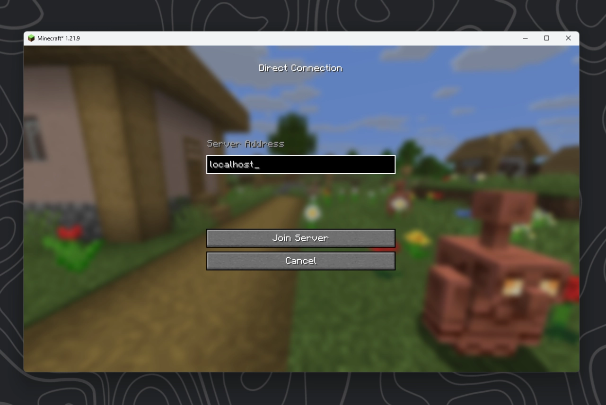

  

</div>

That's it! 🎉 Good job on following this tutorial so far! If you now want other people to join you will need to do some portforwarding, which I also have a [comprehensive guide](./portforwarding) on.

If you have problems with other parts of the vanilla server instructions, take a look at the [detailed vanilla guide.](./detailed-guide/vanilla)

You can stop the server by writing `stop` and pressing enter inside the terminal. You can find more useful commands [here](./detailed-guide/commands).

If you want to support me, please consider subscribing to my [YouTube](https://youtube.com/@celtrius) / [Twitch](https://twitch.tv/celtrius) and checking out my [Patreon](https://patreon.com/Celtrius). Thank you so much!

Alternatively I am always happy about any donation via [PayPal](https://paypal.me/celtrius). <3

## 🌍 Plugin Server {#plugins}

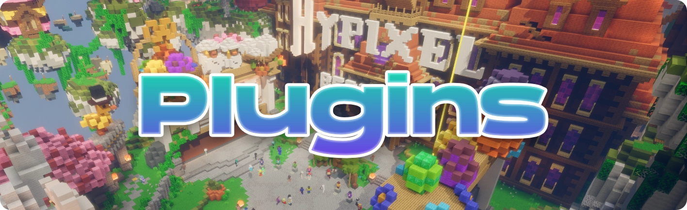

---

You decided you want to create a server that supports plugins? Good choice.<br>
Plugins allow you to add **custom functionality** to your server without having your players required to install anything.
Plugins are what allows **big server networks** like Hypixel to offer minigames, leaderboards, lobby and party systems and so much more!<br>
Whether you want to create your own minigame server, create an SMP with custom commands like `/sethome`, `/tpa` or `/spawn` or want to speedrun the game with custom challenges, plugins will be your way to go!

---

Before you continue, make sure to follow the [folder creation](#folder) guide above. Please also make sure that you have [installed the correct Java version](#java) for your Minecraft version.

---

### Which Version?

Contrary to Vanilla Servers, plugins can allow players from all different Minecraft version to join the same server.
Servers like Hypixel for example let players from both 1.8 and 1.21 connect.

Choosing a version will be an important decision for your server because it will for example decide which ==blocks== you will be able to use.

If you choose an ==older version (e.g. 1.8)==

- ✅ Maximum compatibility: Every newer version can join without issues **\***
- ❌ Limited only to old blocks, mobs and mechanics from 1.8
- ❌ No 1.9 combat system

If you choose a ==newer version (e.g. 1.21)==

- ✅ Access to modern features like blocks, mobs etc.
- ✅ Better server performance & support
- ✅ Can switch between old and new combat system
- ❌ Older client can connect, but the experience may be broken or limited **\***

> _\*only possible with the [ViaVersion plugin](../plugins/viaversion)_

:::info
For most servers, choosing a ==newer version== is the ==correct choice.==<br>
Going for maximum compatibility by running on an old version is only usually done by Minigame Networks like Hypixel for ==maximizing player count==.
:::

---

### Download the Server file {#paper-server}


---

In order to download the PaperMC server `.jar` file, let's open their official website.<br>
If you want your server run on the latest Minecraft version, then you can directly use the download button on their main page.
If you want to use an older version you need to head to their build explorer where you can choose from all available versions.

<div style="display:flex; flex-direction:row; gap:16px; align-items:flex-start;">

<div style="width:50%;">

[Homepage](https://papermc.io/downloads/paper)


After clicking the blue button, the server should start downloading.

</div>
<div style="width:50%;">

[Version Archive](https://fill-ui.papermc.io/projects/paper)

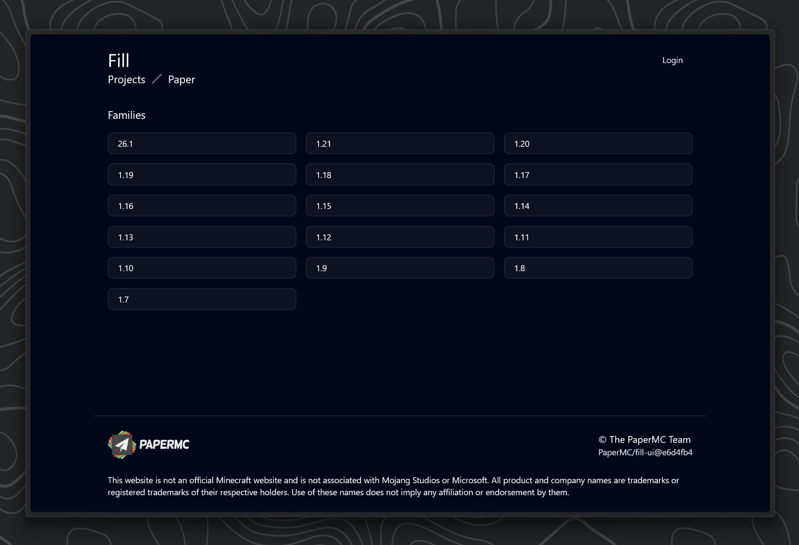

Click on the version you want (like `1.19` for example ) and then click on the subversion you want (e.g. `1.19.4`). Don't worry if it says that the version is "unsupported" that just means that this version is not updated anymore and Paper can't guarantee there are not security issues with this version.

</div>
</div>

---

Move the downloaded server file to your server's folder which you previously created.

Now it's time to create a `batch` file for your server. Read the [instructions](#batch) carefully and come back when you created a `start.bat` file inside the server folder.

If you followed the [folder creation](#folder), [batch file creation](#batch) and the upper [server.jar](#vanilla-server) instructions correctly, your folder should now look like this:

```tree
options:
  showToolbar: false
tree:
- name: "Paper Server"
  note: "Or however you want to call your server"
  children:
      - start.bat
      - server.jar

```

::: warning
Most server files from paper are named something like `paper-1.21.11-130`. Inside the [batch guide](#batch) I mentioned that the file names here need to match.
**You have 2 options:**

1. Rename the server file to `server.jar`
2. Change the `server.jar` part of `-jar server.jar nogui` inside your ==batch file== to the actual file name of the paper server.

⚠️Going forward this tutorial will assume that you renamed the file to ==server.jar== but it should work the same way the other way around.
:::

---

### First Launch and EULA {#paper-eula}

Alright, now its getting interesting! don't give up, you're nearly there! 🎉

1. Double click the `start.bat` file and watch your server boot up for the first time and immediately crash 💀
2. But luckily this is completely normal and the server even gives you the reason why! If we take a look at the logs inside the terminal a few lines from the bottom you will find:<br>
   `[16:57:58] You need to agree to the EULA in order to run the server. Go to eula.txt for more info.`

If we take a look at our server folder now, you should notice that a few new files were created.
It should look more or less like this:

```tree
options:
  showToolbar: false
tree:
- name: "Paper Server"
  children:
      - name: cache
        open: false
        locked: true
        type: folder
      - name: libraries
        open: false
        locked: true
        type: folder
      - name: logs
        open: false
        locked: true
        type: folder
      - name: plugins
        open: false
        locked: true
        type: folder
      - name: versions
        open: false
        locked: true
        type: folder
      - eula.txt
      - server.jar
      - server.properties
      - start.bat

```

You can agree to the [Minecraft EULA](https://www.minecraft.net/eula) by opening `eula.txt` and changing `eula=false` to `eula=true` at the bottom of the file. Don't forget to save the file 💾

---

### Starting & Joining {#paper-start}

Alright, this is it! After opening the batch file again we can see that this time the server does not crash.
If you take a look at the console or the server folder, you can see that there is now a world being generated in the folder! <br>
Good job! Your server is now up and running. 🎉

```log{18}
[20:45:46 INFO]: Preparing level "world"
[20:45:47 INFO]: Loading 0 persistent chunks for world 'minecraft:overworld'...
[20:45:47 INFO]: Preparing spawn area: 100%
[20:45:47 INFO]: Prepared spawn area in 1597 ms
[20:45:47 INFO]: Loading 0 persistent chunks for world 'minecraft:the_nether'...
[20:45:47 INFO]: Preparing spawn area: 100%
[20:45:47 INFO]: Prepared spawn area in 267 ms
[20:45:47 INFO]: Loading 0 persistent chunks for world 'minecraft:the_end'...
[20:45:47 INFO]: Preparing spawn area: 100%
[20:45:47 INFO]: Prepared spawn area in 68 ms
[20:45:47 INFO]: Done preparing level "world" (1.759s)
[20:45:47 INFO]: Done (6.792s)! For help, type "help"
```

Once you see this line in the console, players can join:

```log
Done (1.321s)! For help, type "help"
```

You should now be able to connect to the server by launching a Minecraft version matching your server and then connecting to the IP: `localhost`.

If you want to know how you can now **install plugins** or if you have any other problems, please take a look at the [detailed guide](./detailed-guide/plugins) for the Plugin server.<br>
Specifically the [`Installing Plugins Section`](./detailed-guide/plugins#installing-plugins).

---

You're done! 🎉 Good job on following this tutorial so far! If you now want other people to join you will need to do some portforwarding, which I also have a [comprehensive guide](./portforwarding) on.

You can stop the server by writing `stop` and pressing enter inside the terminal. You can find more useful commands [here](./detailed-guide/commands).

If you want to support me, please consider subscribing to my [YouTube](https://youtube.com/@celtrius) / [Twitch](https://twitch.tv/celtrius) and checking out my [Patreon](https://patreon.com/Celtrius). Thank you so much!

Alternatively I am always happy about any donation via [PayPal](https://paypal.me/celtrius). <3

## 🚀 Modded Server {#modded}

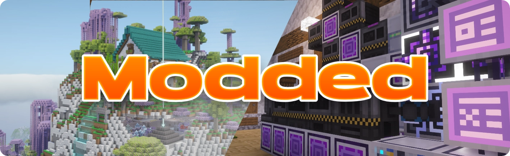

---

Alright, so I heard you want embark for new lands? Fly to the moon? Tame dragons, become the greatest wizard to ever exist and have a storage system so huge it could probably fit every atom in the universe? And do all that together with your friends?
Well then you've certainly come to the right place! 🌟

---

Before you continue, let's create a folder for our modded server with these [instructions](#folder).
Also make sure to [download the correct Java version](#java) for your Minecraft version

---

### Choosing a Mod Loader {#modloader}

Assuming that you want create your own modpack, meaning you want to personally pick the mods you install, you will need to choose a mod loader. If you want to play an existing modpack instead, then please follow the modpack specific server guide. These usually already come with very detailed instructions.

In {{year}} I would only really recommend one of these 3:

<div style="display:flex; gap:16px; width:98%;">

  <a href="https://files.minecraftforge.net/net/minecraftforge/forge/" style="width:33%; " target="_blank" rel="noopener">
  
</a>
  <a href="https://neoforged.net/" style="width:33%; " target="_blank" rel="noopener">
  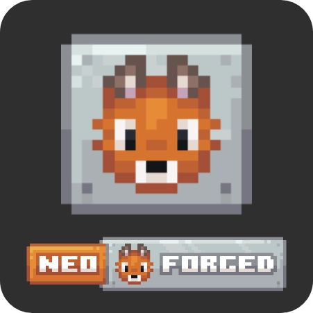
</a>
  <a href="https://fabricmc.net/" style="width:33%; " target="_blank" rel="noopener">
  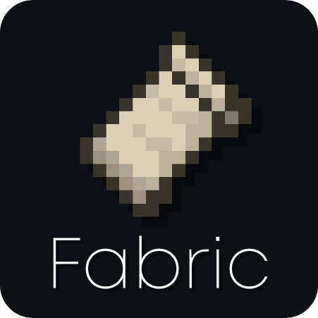
</a>
</div>

None of these are particularly better then the other. It really comes down to what mods you want to play and which version of Minecraft.
Personally I would recommend that you take a look at the mods you are interested in and then note down which mod loader they are supported on.<br>
If you don't have a set of mods just yet and want to keep going anyway, here's a recommendation table:

| Minecraft Version        | Recommended Mod Loader <br> (From left to right) |
| ------------------------ | ------------------------------------------------ |
| 1.1 - 1.16.5             | **Forge**                                        |
| 1.17 - 1.20.1            | **Fabric**, Forge                                |
| 1.20.2 - 26.\* and newer | **Fabric**, NeoForge, Forge                      |

::: info
**The general rule of thumb:** <br>
If you are playing a `newer version` of Minecraft there will be more mods supporting `Fabric and NeoForge`. If you are playing older versions, mods will be more forge biased.
:::

---

### Download the server file {modded-server}

Depending on which mod loader you choose you will have to follow different instructions for downloading the server file. Below you will find 3 sections for the different modloaders. Jump to the one important for you with these links:

---

#### ✨ Forge Server {#forge-server}

Visit the official [forge website](https://files.minecraftforge.net/net/minecraftforge/forge/) and select a Minecraft version in the left sidebar.
Then download the server installer by clicking on "Installer" in the "Download Recommended" section. If you need a specific forge version you can click on the "Show all Versions" button. Please keep in mind that this is talking about different forge versions for the same Minecraft version.

Wait for 5 seconds while ignoring the ads and then click the "Skip" button at the top right. Open the downloaded installer `.jar` file.

<div style="display:flex; width:98%; flex-direction:row; gap:16px; align-items:flex-start;">

  <div style="width:70%;">

Once you open the installer make sure to select "Install server"
After that select the path of your Minecraft server down below.

 </div>

  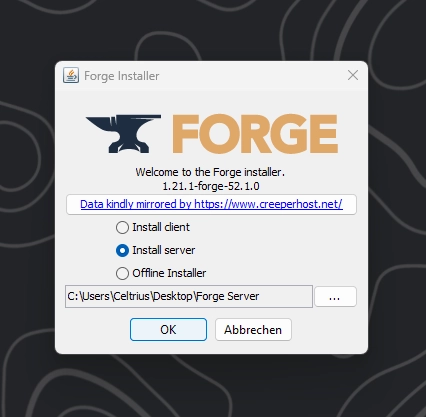

</div>

Please remember the forge version your server is running on because when you want to join with a client, that one needs to be running on the same forge version. That means either select the correct version in your preferred Minecraft Launcher or after installing the server, reopen the installer above and select "Install client" as well as your `.minecraft` path instead.

---

#### ✨ Fabric Server {#fabric-server}

Downloading the fabric server file is pretty much as simple as vanilla.
Go to the official [fabric server](https://fabricmc.net/use/server/) page. Here you can select your Minecraft version and if you need even a specific fabric version. After clicking the blue button you are already done. You can move that downloaded `.jar` file into your Minecraft server folder.

---

#### ✨ NeoForge Server {#neoforge-server}

This one is pretty similar to the Forge server. First you need to head to the official [NeoForge Website](https://neoforged.net/) and download the installer by selecting your Minecraft version and then clicking the big orange button.

<div style="display:flex; width:98%; flex-direction:row; gap:16px; align-items:flex-start;">

  <div style="width:70%;">

Select `Install Server` and select the `path to your Minecraft server folder` below.

 </div>

  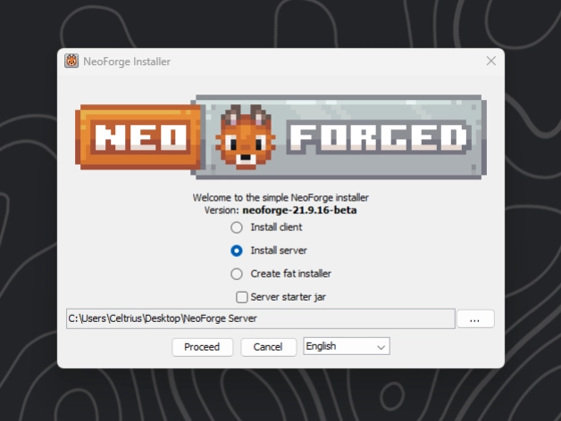

</div>

---

### Modded folder setup {#modded-folder}

Make sure that you followed the steps above correctly.
If you choose the Fabric server or an older Forge / NeoForge Version where the installer does not provide you with a `.bat` file, please follow the [instructions](#batch) for creating your own batch file.

Your folder should now look like one of these 3

<div style="display:flex; gap:16px; width:98%;">

  <div style="width:50%; " target="_blank" rel="noopener">

[Forge](#forge-server) (with provided `.bat` file)

```tree
options:
  showToolbar: false
tree:
- name: "Forge Server"
  children:
      - name: libraries
        open: false
        locked: true
        type: folder
      - forge-<version>.jar
      - README.txt
      - run.bat
      - run.sh
      - user_jvm_args.txt
```

</div>
  <div style="width:50%; " target="_blank" rel="noopener">

[Fabric](#fabric-server)

```tree
options:
  showToolbar: false
tree:
- name: "Fabric Server"
  children:
      - server.jar
      - start.bat
```

</div>
</div>

<div style="display:flex; gap:16px; width:98%;">

  <div style="width:50%; " target="_blank" rel="noopener">

[NeoForge](#forge-server) (with provided `.bat` file)

```tree
options:
  showToolbar: false
tree:
- name: "NeoForge Server"
  children:
      - name: libraries
        open: false
        locked: true
        type: folder
      - run.sh
      - run.bat
      - user_jvm_args.txt

```

</div>
  <a style="width:50%; " target="_blank" rel="noopener">

</a>
</div>

::: info
If you choose a Forge or NeoForge server and are installing a server for a newer version, they already provide a perfect setup with a batch file pre installed. That means you can skip creating a batch file and renaming of any files.
:::

::: warning
As previously talked about, if we use our own batch file for example for fabric servers or older Forge / NeoForge servers that don't already provide a batch file, we need to make sure that the file names match. That means you either need to rename the server file into `server.jar` or edit your own batch file so that at the end of the file the `server.jar` in the `-jar server.jar nogui` matches the name of your actual server file in the folder.
:::

### First Launch and EULA

After double clicking the bat file your server will boot up and immediately crash 💀<br>
But luckily that is completely normal since we first need to agree to the [Minecraft EULA](https://www.minecraft.net/eula).

```tree
options:
  showToolbar: false
tree:
- name: "Modded Server"
  children:
      - ...
      - eula.txt

```

Open the `eula.txt` file that was just created and edit the last line from `eula=false` to `eula=true`. After that save the file and reopen the `.bat` file again.

---

### Starting & Joining {#joining-modded}

Alright, that's pretty much it! After reopening the server and waiting for the world to generate you should see the following line in the console at some point:

```log
[17:18:54] [Server thread/INFO]: Done (0.260s)! For help, type "help"
```

This means that at that point you should be able to join the server on the IP `localhost`
If you want your friends to join, checkout the [Portforwarding](./portforwarding) guide.

If you already know how, you can now start installing mods by dragging the files into the `mods` folder and then restarting the server. If you don't know how or have any other problems, please take a look at the [detailed guide](./detailed-guide/plugins) for the Modded server.<br>
Over there you can find detailed instructions for [`installing mods`](./detailed-guide/modded#installing-mods).

---

That's it! 🎉 Good job on following this tutorial so far! If you now want other people to join you will need to do some portforwarding, which I also have a [comprehensive guide](./portforwarding) on.

You can stop the server by writing `stop` and pressing enter inside the terminal. You can find more useful commands [here](./detailed-guide/commands).

If you want to support me, please consider reading the Afterword below <3

## ♥️ Afterword

If you read my guide to this point I want to personally thank you. I know for you this might've been just something you randomly found on the internet but for me this is a project that I've been working on for many weeks. I really appreciate you taking your time to read my guide.

Minecraft servers have been my passion for many years now. I remember when I first applied as a developer for a minecraft server in 2018 when I was just 14 years old 😂. Back then I could not even code but they took me anyway. Ever since then I have been working with servers.<br>
Since 2019 I have been locally hosting servers on my computer whenever I want to play modpacks with my friends. I used to have a folder on an external HDD that contained over 150 different Minecraft servers, unfortunately that hard drive died last year which was pretty devastating 😅

If you have any other problems or questions feel free to write a comment on my [YouTube](https://youtube.com/@celtrius), joining my [Discord](https://discord.com/invite/WEEKAvK8fQ) server or chatting with me while I am live on [Twitch](https://twitch.tv/celtrius)!

If you want to support me, please consider subscribing to my [YouTube](https://youtube.com/@celtrius) / [Twitch](https://twitch.tv/celtrius) and checking out my [Patreon](https://patreon.com/Celtrius). Thank you so much!

Alternatively I am always happy about any donation via [PayPal](https://paypal.me/celtrius). <3
