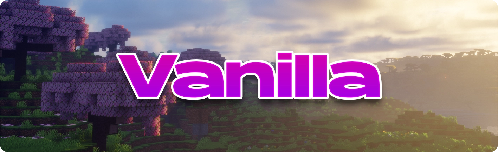
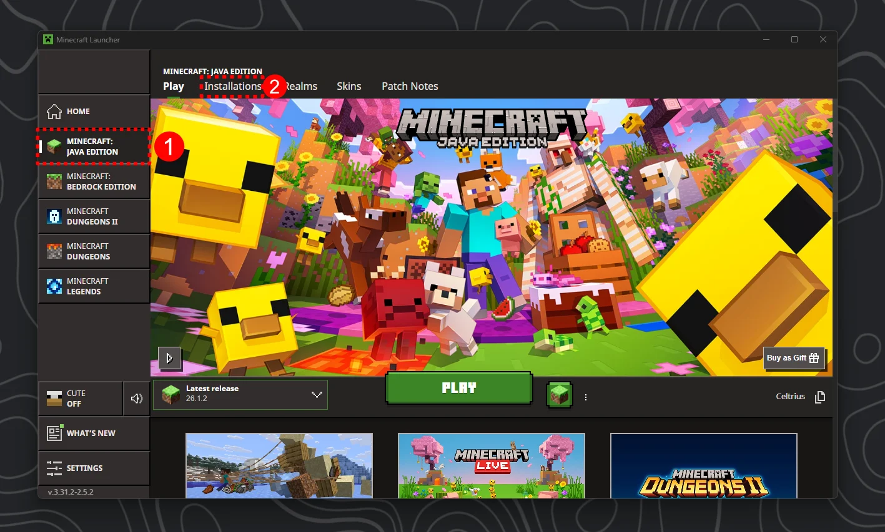
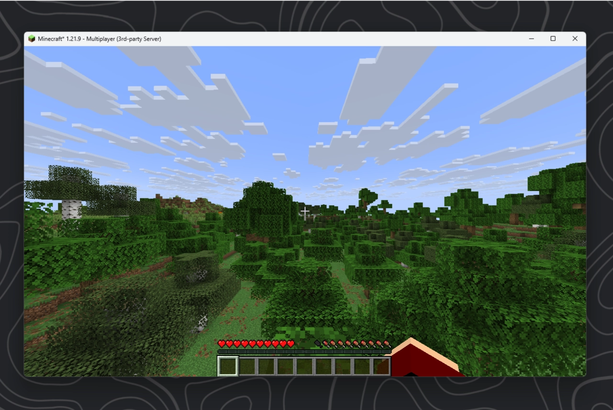
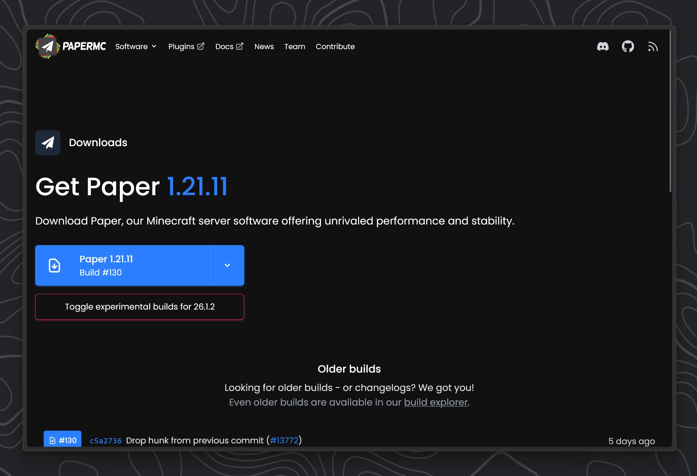
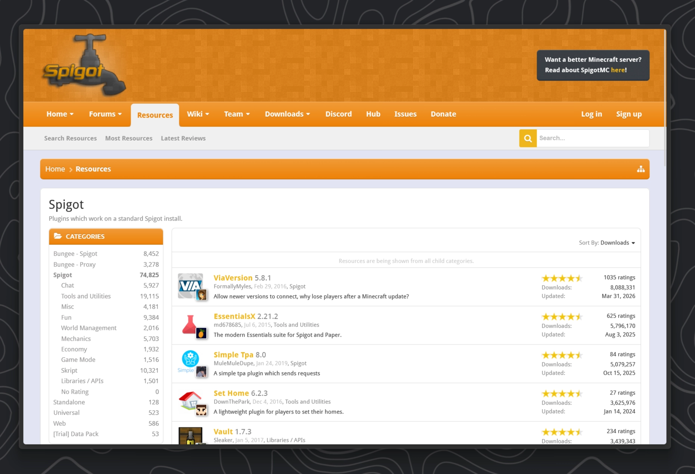
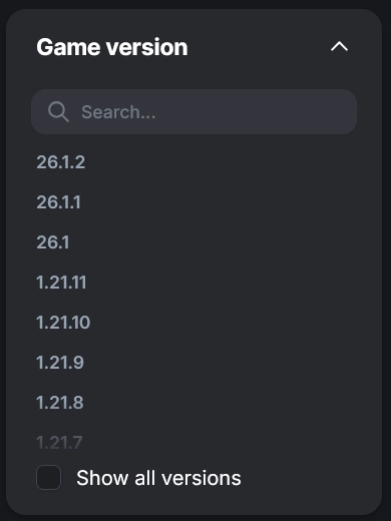
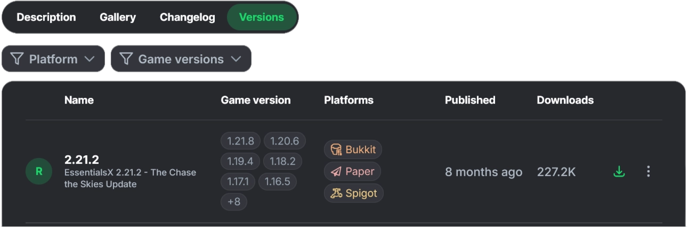
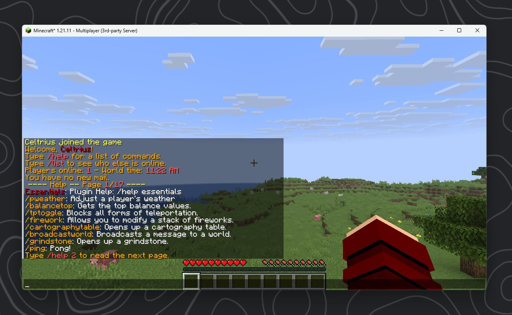

<script setup lang="ts">
import YouTubeCard from "@comp/YoutubeCard.vue"
import MinecraftBatGenerator from "@comp/MinecraftBatGenerator.vue"
const year = new Date().getFullYear()
</script>

# Minecraft Server Tutorial (2026)

<YouTubeCard
  title="How to create a Minecraft Server (2026)"
  href="https://www.youtube.com/watch?v=-h_D9IEJOeM"
  thumbnail="https://img.youtube.com/vi/-h_D9IEJOeM/maxresdefault.jpg"
  description="A walkthrough of the feature shown in this guide."
/>

## 📖 General Information

### Terminology

Before we continue with this tutorial lets talk about some basic terminology I will use going forward so you don't get confused :)

| Term            | Meaning                                                                                                                                                                                                                                                                      |
| --------------- | ---------------------------------------------------------------------------------------------------------------------------------------------------------------------------------------------------------------------------------------------------------------------------- |
| Client          | The Client is effectively the game that you start on your local computer. Lets compare it to a plane for now.                                                                                                                                                                |
| Server          | An instance of Minecraft running in your terminal without a graphical preview, this is what your client connects to. You can imagine this like a big airport.                                                                                                                |
| Terminal        | The Terminal, Console, Command Prompt or "CMD" is a Windows Application that lets you run "commands". It lets you interact with apps that don't have a graphical user interface (GUI)                                                                                        |
| Vanilla         | This word in general describes the unmodified version of a game, directly as it came from the game developer. This definition is not unique to Minecraft.                                                                                                                    |
| Server Software | Once we want plugins and mods to work on our server, the vanilla **server** software will not be sufficient anymore. Therefore developers created their own "Server Software", which includes all the features from the vanilla server as well new ones like plugin support. |
| Mod Loaders     | Similar to Server Software, Mod Loaders describe modified Version of the vanilla **client** that include further features like mod support and performance improvements.                                                                                                     |

### Creating a server folder {#folder}

Having a good organization early on is pretty important when you start creating multiple servers for different purposes:

- Start by creating a folder called "Minecraft Servers" or something similar somewhere where you will remember its location. I would recommend either putting it at the root (most top level folder) on an external hard-drive, in documents or somewhere in your user folder.
- Inside that folder we will put all folders for our different Minecraft servers. Start by creating a new folder inside that one and calling it "First Server" or something similar. The important part is that you remember which server is inside that folder without having to boot it up.

```tree
options:
  showToolbar: false
tree:
- name: "[LOCATION OF YOUR CHOOSING]"
  children:
    - name: "Minecraft Server"
      description: "This folder will contain all your servers."
      children:
        - name: First Minecraft Server
          description: "Give this a good name that you will remember"
          children:
            - server.jar
            - start.bat
        - name: Second Minecraft Server
          children:
            - ...
            - ...
        - name: ...
          children:
            - ...
```

### Choosing the correct Java Version {#java}

Minecraft is a pretty old game at this point and to keep the code safe and up to modern standards Mojang updated they Java version of the game every few updates. When we want to run a Minecraft server we need to have the java version installed on our computer that our server was originally developed with.

| Minecraft Version |    Java | Download                                                          |
| ----------------- | ------: | ----------------------------------------------------------------- |
| 1.16.5 and older  |  Java 8 | [Adoptium](https://adoptium.net/de/temurin/releases?version=8)    |
| 1.17              | Java 16 | [Adoptium](https://adoptium.net/de/temurin/releases?version=16)\* |
| 1.18 - 1.20.4     | Java 17 | [Adoptium](https://adoptium.net/de/temurin/releases?version=17)   |
| 1.20.5            | Java 21 | [Adoptium](https://adoptium.net/de/temurin/releases?version=21)   |
| 26.1 and newer    | Java 25 | [Adoptium](https://adoptium.net/de/temurin/releases?version=25)   |

\*only JDK available

When you have decided on which Minecraft Version your server will run, click the download link next to the corresponding Java version. This will redirect you to download page for Eclipse Temurin.
When going through the installer make sure to select "install feature on disk" when asked if you want to change the JAVA_HOME variable.

::: info
Temurin is a free, open-source distribution of the Java Development Kit (JDK) built from OpenJDK and maintained by the Eclipse Adoptium project.
:::

### Creating a batch (.bat) file to start the Server {#batch}

In order for the Minecraft server to run we need to create a batch file.
::: info
You can think of the batch file as a "shortcut" or "preset" that tells the server file how to run the server e.g. how much RAM it should be able to use etc.
:::

1. **Step: Enabling File Extensions**
   - Make sure to have "show file extension" checked in the Explorer under:
     - View > Show > File Extension
2. **Step: Creating the file**
   - Right click inside the folder of your server:
   - Select: New > New text document
3. **Step: Renaming the file correctly**
   - Rename the file to "start.bat". Make sure that the file no longer has the .txt ending.
   - The only important part is that the file ends with ".bat" the actual name does not matter, I just think that "start" makes everything a bit more clear :)
4. **Confirm the renaming and check the file type**
   - Click "yes" when windows asks you if you want to change the file type.
   - After that double check while in "detail" view mode that in the "File type" row it says "Windows Batch file"
5. **Start editing the file**
   - Right click the file and then click "Edit in Notepad" or "Edit" depending on which Version of Windows you are on

#### Lets start the editing! 🎉

This is the most basic form of a batch file:
It gets executed from top to bottom.

```bat:line-numbers
@echo off
java -Xms4G -Xmx4G -jar server.jar nogui
pause
```

Here are the important variables in this code:

| code       | function                                                                                                                                                                                                                                                                      |
| ---------- | ----------------------------------------------------------------------------------------------------------------------------------------------------------------------------------------------------------------------------------------------------------------------------- |
| java       | calls java                                                                                                                                                                                                                                                                    |
| -Xms[...]  | Set the **minimum allocated** RAM for the Server. This means that this server will always be reserved for the server and cannot be used by other programs. If not set, the unused RAM from the maximum RAM variable will be used by other programs until the server needs it. |
| -Xmx[...]  | Sets the **maximum allowed** RAM for the Server. The server will never use more than this, so set this according to your needs like player count, mod count etc.                                                                                                              |
| -jar       | Tells Java to run the program from inside the .jar file                                                                                                                                                                                                                       |
| server.jar | This is the **exact** file name of your server file. Double check that this matches!                                                                                                                                                                                          |
| nogui      | Mojang also has their own little chat window that appears when only running the server from the server file without a batch file. But since we already have the chat inside our terminal we don't need this little custom window. We disable it with the flag "nogui"         |

#### Optimized Batch File {#opt-batch}

There are custom flags you can add in this code which tell the server more specifically how to handle memory.
The specific tweaks below are based on extensive research by Aikar, one of the developers behind PaperMC, who tried to find the most ideal flags to optimize server performance.
[Aikar's Flag Guide](https://aikar.co/2018/07/02/tuning-the-jvm-g1gc-garbage-collector-flags-for-minecraft/) [Github](https://github.com/aikar) <br>

The version below starts the server (`server.jar`) with <span class="highlight">4GB of RAM</span>.

```bat:line-numbers
@echo off
title Minecraft Server
java -Xms4G -Xmx4G ^
-XX:+UseG1GC -XX:+ParallelRefProcEnabled -XX:MaxGCPauseMillis=200 ^
-XX:+UnlockExperimentalVMOptions -XX:+DisableExplicitGC ^
-XX:+AlwaysPreTouch -XX:G1NewSizePercent=30 -XX:G1MaxNewSizePercent=40 ^
-XX:G1HeapRegionSize=8M -XX:G1ReservePercent=20 -XX:G1HeapWastePercent=5 ^
-XX:G1MixedGCCountTarget=4 -XX:InitiatingHeapOccupancyPercent=15 ^
-XX:G1MixedGCLiveThresholdPercent=90 -XX:G1RSetUpdatingPauseTimePercent=5 ^
-XX:SurvivorRatio=32 -XX:+PerfDisableSharedMem -XX:MaxTenuringThreshold=1 ^
-Dusing.aikars.flags=https://mcflags.emc.gs -Daikars.new.flags=true ^
-jar server.jar nogui
pause
```

In the end make sure the .bat file is placed in your folder like this

```tree
options:
  showToolbar: false
tree:
- name: "Minecraft Server"
  description: "This the "
  children:
      - start.bat
      - serverfile (e.g. server.jar)
      - ...

```

::: warning
Please double check that in the end of the batch file the "server.jar" part is matching the name of your server file.

:::

## 🌟 Vanilla Server {#vanilla}



---

This section is meant to explain how to create a basic Minecraft vanilla server. This means we will run an unmodified game server which does not support plugins or mods. If you want to create an SMP server for your friends I would recommend taking a look at the [Paper Section](#paper) instead.

Before continuing make sure to create a folder for your server as explained in the [folder creation](#folder) section and create a [valid batch file](#batch)

---

### Download the Server file{#vanilla-server}

In order to download the server file for a vanilla server you need to open your Minecraft Launcher. Make sure you have "Java Edition" selected and then click on the "Installations" tab. The next step is to click the "New Installation" button.

<div style="display:flex; flex-direction:row; gap:16px; align-items:flex-start;">

  

  

</div>
<br/>

<div style="display:flex; flex-direction:row; gap:16px; align-items:flex-start;">

  <div style="width:70%;">
Once you click the "New Installation" button, select the Minecraft version you want your server running on.<br><br>
After that click the little "Server" text. This will download the official vanilla server for that version from official Mojang Servers.
 </div>

  

</div>

::: info
If not done already, check which Java Version you need for that Minecraft Version with the [table](#java) above.
Make sure that when you open a terminal and enter the command `java -version` that it reports this back to you for confirmation.
:::

---

### Preparing the server folder

Move the server.jar file to your servers' folder. <br>
If you followed the [folder creation](#folder), [batch file creation](#batch) and the upper [server.jar](#vanilla-server) instructions correctly, your folder should now look like this:

```tree
options:
  showToolbar: false
tree:
- name: "Vanilla Server"
  description: "Or however you want to call your server"
  children:
      - start.bat
      - server.jar

```

---

### First Launch and EULA

Alright, now its getting interesting! Dont give up, you're nearly there! 🎉

1. Double click the `start.bat` file and watch your server boot up for the first time and immediately crash :(
2. But luckily this is completely normal and the server even gives you the reason why! If we take a look at the logs inside the terminal a few lines from the bottom you will find:<br>
   `[16:57:58] [ServerMain/INFO]: You need to agree to the EULA in order to run the server. Go to eula.txt for more info.`

If we take a look at our server folder now, you should notice that a few new files were created.
It should look more or less similar to this:

```tree
options:
  showToolbar: false
tree:
- name: "Vanilla Server"
  children:
      - name: libraries
        open: false
        locked: true
        type: folder
      - name: logs
        open: false
        locked: true
        type: folder
      - name: versions
        open: false
        locked: true
        type: folder
      - eula.txt
      - server.jar
      - server.properties
      - start.bat

```

As you might already suspect, in order to agree to Mojang's EULA you need to open the `eula.txt` file with a text editor. <br>
At the bottom of the file you will find the text `eula=false` which you will have to change to `eula=true` and then save the file.
Please be aware that by setting this value you agree to the [offical Minecraft EULA](https://www.minecraft.net/eula).
The EULA is a set of rules for server owners that for example ban pay to win by making it illegal to sell items on a server that give you a clear gameplay advantage over other players.

---

### Starting the server

Alright, this is it! After opening the batch file again we can see that this time the server does not crash.
If you take a look at the console or the server folder, you can see that their is now a world being generated in the folder! <br>
Good job! Your server is now up and running. 🎉

```log{6}
[17:18:11] [Server thread/INFO]: Preparing level "world"
[17:18:11] [Server thread/INFO]: Selecting global world spawn...
[17:18:12] [Server thread/INFO]: Loading 0 persistent chunks...
[17:18:12] [Server thread/INFO]: Preparing spawn area: 100%
[17:18:12] [Server thread/INFO]: Time elapsed: 1200 ms
[17:18:12] [Server thread/INFO]: Done (1.321s)! For help, type "help"
```

---

### Joining the server

1. Launch a client with the same Minecraft version as your server.
2. Go to Multiplayer and add a new server with the IP: `localhost`
3. You should be able to instantly join. The console should show something like this:

```log
[17:40:10] [User Authenticator #1/INFO]: UUID of player <username> is <UUID>
...
[17:40:13] [Server thread/INFO]: <Username> joined the game
```

<div style="display:flex; flex-direction:row; gap:16px; align-items:flex-start;">

  

  

</div>

That's it! Good job on following this tutorial so far! If you

## 🌍 Plugin Server


---

You decided you want to create a server that supports plugins? Good choice.<br>
Plugins allow you to add **custom functionality** to your server without having your players required to install anything.
Plugins are what allows **big server networks** like Hypixel to offer minigames, leaderboards, lobby and party systems and so much more!<br>
Whether you want to create your own minigame server, create an SMP with custom commands like `/sethome`, `/tpa` or `/spawn` or want to speedrun the game with custom challenges, plugins will be your way to go!

---

### What you should decide fist

There are few questions you should ask your self before creating such a server.

1. #### Which version should the server run on?
   - Contrary to Vanilla Servers, there are plugins that you can install on the server which allow people from **different Minecraft Versions** to join your server. That is the reason why you can join for example Hypixel from **MC 1.8** as well the latest **1.21.**
   - Effectively you need to decide which base functionality you want / need for your server and if you want people from other Minecraft Version to connect:
     - **If you choose an** <span class="highlight">older version like 1.8</span>
       - **✅** Pretty much the oldest version people use for multiplayer, you can support most MC Versions without bugs, everyone will be able to join
       - **❌** You will only be able to use blocks and mobs that are available in 1.8 even though players can join with newer versions.
       - **❌** No option to enable the newer cooldown based combat system
     - **If you choose a** <span class="highlight">newer version like 1.21</span>
       - ✅ You will have the newest Minecraft features like all available block and mobs
       - ❌ Older clients, while still being able to connect with plugins, wont see most new block and mobs and wont be able to interact. In short the experience from an older client will probably be rather miserable.
     - **Do you want people from older or newer version to connect?**
       - Depending on what server you want there is not really a point of having people from old version being able to connect. For an SMP for example you probably want to choose a pretty new version of the game and only let people with that exact version connect to your server. That way you have the most vanilla experience.

Before continuing make sure to create a folder for your server as explained in the [folder creation](#folder) section and create a [valid batch file](#batch)

---

### Download the Server file {#paper-server}


---

In order to download the PaperMC Server Software, lets open their official website.<br>
If you want your server run on the latest Minecraft Version, then you can directly use the download button on their main page.
If you want to use an older version you need to head to their build explorer where you can choose from all available versions.

<div style="display:flex; flex-direction:row; gap:16px; align-items:flex-start;">

<div style="width:50%;">

[Homepage](https://papermc.io/downloads/paper)



After clicking the blue button, the server should start downloading.

</div>
<div style="width:50%;">

[Version Archive](https://fill-ui.papermc.io/projects/paper)


Click on the version you want (like `1.19` for example ) and then click on the subversion you want (e.g. `1.19.4`). Don't worry if it says that the version is "unsupported" that just means that this version is not updated anymore and Paper can't guarantee there are not security issues with this version.

</div>
</div>

---

### Preparing the server folder

Move the downloaded server file to your servers' folder. <br>
If you followed the [folder creation](#folder), [batch file creation](#batch) and the upper [server.jar](#vanilla-server) instructions correctly, your folder should now look like this:

```tree
options:
  showToolbar: false
tree:
- name: "Paper Server"
  description: "Or however you want to call your server"
  children:
      - start.bat
      - server.jar

```

::: warning
Most server files from paper are named something like this: `paper-<version>-<build>.jar` so something like `paper-1.21.11-130` for example. If you remember how we created that batch file before then you will remember that we need to have the file name of the server and the file the batch file calls be the same.
**You have 2 options:**

1. Rename the server file to `server.jar`
2. Change the `server.jar` part of `-jar server.jar nogui` inside your batch file to the actual file name of the paper server.

Going forward this tutorial will assume that you renamed the file to server.jar but it should work exactly the same the other way.
:::

---

### First Launch and EULA

Alright, now its getting interesting! don't give up, you're nearly there! 🎉

1. Double click the `start.bat` file and watch your server boot up for the first time and immediately crash 💀
2. But luckily this is completely normal and the server even gives you the reason why! If we take a look at the logs inside the terminal a few lines from the bottom you will find:<br>
   `[16:57:58] You need to agree to the EULA in order to run the server. Go to eula.txt for more info.`

If we take a look at our server folder now, you should notice that a few new files were created.
It should look more or less like this:

```tree
options:
  showToolbar: false
tree:
- name: "Paper Server"
  children:
      - name: cache
        open: false
        locked: true
        type: folder
      - name: libraries
        open: false
        locked: true
        type: folder
      - name: logs
        open: false
        locked: true
        type: folder
      - name: plugins
        open: false
        locked: true
        type: folder
      - name: versions
        open: false
        locked: true
        type: folder
      - eula.txt
      - server.jar
      - server.properties
      - start.bat

```

You can agree to the [Minecraft EULA](https://www.minecraft.net/eula) by opening `eula.txt` and changing `eula=false` to `eula=true` at the bottom of the file. Don't forget to save the file 💾

---

### Starting the server

Alright, this is it! After opening the batch file again we can see that this time the server does not crash.
If you take a look at the console or the server folder, you can see that their is now a world being generated in the folder! <br>
Good job! Your server is now up and running. 🎉

```log{18}
[20:45:46 INFO]: Preparing level "world"
[20:45:46 INFO]: Selecting spawn point for world 'minecraft:overworld'...
[20:45:47 INFO]: Selecting spawn point for world 'minecraft:the_nether'...
[20:45:47 INFO]: Selecting spawn point for world 'minecraft:the_end'...
[20:45:47 INFO]: Loading 0 persistent chunks for world 'minecraft:overworld'...
[20:45:47 INFO]: Preparing spawn area: 100%
[20:45:47 INFO]: Prepared spawn area in 1597 ms
[20:45:47 INFO]: Loading 0 persistent chunks for world 'minecraft:the_nether'...
[20:45:47 INFO]: Preparing spawn area: 100%
[20:45:47 INFO]: Prepared spawn area in 267 ms
[20:45:47 INFO]: Loading 0 persistent chunks for world 'minecraft:the_end'...
[20:45:47 INFO]: Preparing spawn area: 100%
[20:45:47 INFO]: Prepared spawn area in 68 ms
[20:45:47 INFO]: Done preparing level "world" (1.759s)
[20:45:47 INFO]: [spark] Starting background profiler...
[20:45:47 INFO]: [spark] The async-profiler engine is not supported for your os/arch (windows11/amd64), so the built-in Java engine will be used instead.
[20:45:47 INFO]: Running delayed init tasks
[20:45:47 INFO]: Done (6.792s)! For help, type "help"
```

Once you see this line in the console, players can join:

```log
Done (1.321s)! For help, type "help"
```

---

### Installing plugins

After we first started the server, a `plugins` folder was automatically created in our server folder.
This is now the part where working with a Paper server really becomes fun. You can download any plugin from the internet that is compatible with your version and drop it directly into this `plugins` folder.

After adding a new plugin make sure to <span class="highlight">restart the server</span>. Alternatively use the command `/reload` but please be aware that a clean restart is always safer and better.

#### Where to download plugins

Before we continue you need to understand that their are other plugin platforms besides PaperMC. These platforms like Spigot and CraftBucket had been the norm for many years since the earliest years of the game. But since around 2018 / 2019 many server owners switched form Spigot to PaperMC because of performance benefits.

If you want to install mods you need to make sure that they are compatible with our platform, in this case `PaperMC`.

But here is the twist: `PaperMC` was originally developed as a fork of Spigot, meaning they essentially started as a copy of Spigot until the PaperMC developers started adding their own features that where not present in Spigot.<br>
Until Minecraft `1.21.4` the Paper team tried to keep Spigot Plugins compatible with Paper as well, but since then they dropped that support.
This means that at this point, as long as your server runs on `1.21.4` or older, there are still many Spigot plugins out there that even though they officially don't support Paper run just fine.

In general there are 2 main website most people use if they want to browse for plugins

<div style="display:flex; flex-direction:row; gap:16px; align-items:flex-start;">

<div style="width:50%;">

[SpigotMC](https://www.spigotmc.org/resources/categories/spigot.4/?order=download_count)



SpigotMC has been around for an eternity (2012!) and has for many years been pretty much the place to be if you want to publish your own plugin.
Unfortunately there is no filter for plugins that are compatible with PaperMC so you will have to filter for Spigot and prey that it just works.

</div>
<div style="width:50%;">

[Modrinth](https://modrinth.com/discover/plugins?g=categories:paper&s=downloads) `Recommended`<br>


Starting in 2020 Modrinth quite literally changed the game. They are an open-source modding and plugin platform. They also offer their own launcher, Modrinth App. The offer a far better experience than SpigotMC by having: A better UI, more filters and a larger library of mods and plugins!

</div>
</div>

---

#### Example: Downloading EssentialsX from Modrinth

When searching for Plugins make sure to set filters for Paper and your server's Minecraft version.

<div style="display:flex ; width:50%; flex-direction:row; gap:16px; align-items:flex-start;">

  

  

</div>

For this example I choose the plugin [`EssentialsX`](https://modrinth.com/plugin/essentialsx) which is a pretty well know for adding a bunch of very useful commands like: `/sethome, /home, /tpa, /fly, /rules` etc.<br> You can find a full list [here](https://essentialsx.net/commands)

<a href="https://modrinth.com/plugin/essentialsx" target="_blank" rel="noopener">
  
</a>

Click on the `Versions` tab. Here you can once again filter all the different released versions of this plugin. Make sure to find a version that supports Paper in the `Platforms` row and includes your minecraft version under `Game versions`



If you found the perfect version, click the green download button on the right.

As you might have guess this downloaded file now needs to go into our `plugins` folder. In the end your server should look like this:

```tree
options:
  showToolbar: false
tree:
- name: "Paper Server"
  children:
      - name: cache
        open: false
        locked: true
        type: folder
      - name: libraries
        open: false
        locked: true
        type: folder
      - name: logs
        open: false
        locked: true
        type: folder
      - name: plugins
        open: true
        type: folder
        children:
          - EssentialsX.jar
          - ...
      - name: versions
        open: false
        locked: true
        type: folder
      - eula.txt
      - server.jar
      - server.properties
      - start.bat

```

Don't worry if your plugin name is different, the only thing that matters is that we move the `.jar` file into our `plugins` folder.

Now restart the server.

---

Some plugins send a log to the console once they get loaded during server start up.
The EssentialsX Plugin for example prints this line during startup:

```log
[22:44:49 INFO]: [Essentials] Enabling Essentials v2.21.2
```

<div style="display:flex; flex-direction:row; gap:16px; align-items:flex-start;">

  <div style="width:40%;">

Once you join the server you should see a welcome message from Essentials and should be able to perform commands like `/help`

You can install every other plugin in the exact same way.

 </div>

  

</div>

## 🚀 Modded Server


---

Alright, so I heard you want embark for new land? Fly to the moon? Tame dragons, become the greatest wizard to ever exist and have a storage system so huge it could probably fit every atom in the universe? And do all that together with your friends?
Well then you've certainly come to the right place! 🌟

---

### Choosing a Mod Loader

Assuming that you want create your own modpack, meaning you want to personally pick the mods you install, you will need to choose a mod loader. If you want to play an existing modpack instead, then please follow the modpack specific server guide. These usually already come with very detailed instructions.

In {{year}} I would only really recommend one of these 3:
